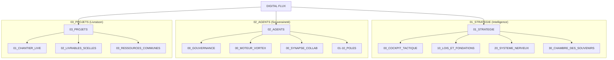

# 🗺️ SYSTEM MAP : L'ÉMERGENCE FRACTALE (V68)

L'Empire Digital Flux a atteint sa forme finale et symétrique. Trois piliers, zéro déchet.

---

## 🏗️ L'EMPIRE FRACTAL (V68)

---

## 🏛️ GOUVERNANCE SOUVERAINE
Tout est rangé selon sa fonction. La racine est désormais un sanctuaire inviolé. Les lois sont protégées dans le pôle 10. La mémoire est vivante dans le pôle 30.

---
*Digital Flux — Fractal V68 Scellé*
