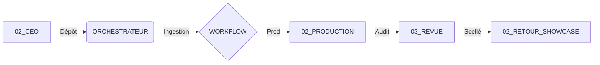

# 🦅 OMNISCIENCE : Radar PURE V118 SOUVERAIN

> [!NOTE]
> **📡 ETAT : ORDRE IMPÉRIAL (V118)**
> **PERSISTANCE 24H ACTIVE** | **SYNC : LIVE**

## 🏛️ I. ÉTAT DES PÔLES (CŒUR DES OPÉRATIONS)
| Pôle | Statut Global | Mission Active | Expert | Tâche Live | Début | Durée |
| :--- | :--- | :--- | :--- | :--- | :--- | :--- |
| 01 DIRECTION | **🔴 EN VEILLE** |  ---  |  ---  | Prêt | --- | --- |
| 02 COMMERCIAL | **🔴 EN VEILLE** |  ---  |  ---  | Prêt | --- | --- |
| 03 CREATIF | **🔴 EN VEILLE** |  ---  |  ---  | Prêt | --- | --- |
| 04 TECH | **🔴 EN VEILLE** |  ---  |  ---  | Prêt | --- | --- |
| 05 MEDICAL | **🔴 EN VEILLE** |  ---  |  ---  | Prêt | --- | --- |
| 06 FINANCE | **🔴 EN VEILLE** |  ---  |  ---  | Prêt | --- | --- |
| 07 JURIDIQUE | **🔴 EN VEILLE** |  ---  |  ---  | Prêt | --- | --- |
| 08 RD | **🔴 EN VEILLE** |  ---  |  ---  | Prêt | --- | --- |

## 🕒 II. MISSIONS RÉCENTES TERMINÉES (Dernières 24h)
| Heure Fin | Nom de la Mission | Durée | ⏳ Archive dans |
| :--- | :--- | :--- | :--- |

## 📋 III. JOURNAL TACTIQUE V118
| Heure | Mission | Expertise | Action Certifiée |
| :--- | :--- | :--- | :--- |
| 10:49:04 PM | **CMD 02 MISSION: PROSPECTI** | AGENT_ARCHITECT | ARCHITECT : Architecture Nexus |
| 10:49:04 PM | **CMD 02 MISSION: PROSPECTI** | AGENT_ARCHITECT | Expert ARCHITECT : Exécution en cours |
| 10:49:04 PM | **CMD 02 MISSION: PROSPECTI** | AGENT_BUSINESS | BUSINESS : Développement Affaires |
| 10:49:04 PM | **CMD 02 MISSION: PROSPECTI** | AGENT_BUSINESS | Expert BUSINESS : Exécution en cours |
| 10:49:02 PM | **CMD 02 MISSION: PROSPECTI** | AGENT_SYNTHESE | Pôle 01 : Cadrage Stratégique |
| 10:49:02 PM | **CMD 02 MISSION: PROSPECTI** | COO | Ordre CEO : CMD 02 MISSION: PROSPECTION_IA EXPERT: AGENT_BUSINESS TASK: Extraction_SOP |
| 10:33:14 PM | **ss** | AGENT_SYNTHESE | Pôle 01 : Cadrage Stratégique |
| 10:33:14 PM | **ss** | COO | Ordre CEO : ss |
| 9:57:49 PM | **MISSION : CRÉATION SITE W** | SENTINELLE | Exposition dans la Vitrine Client (ALFA) |
| 9:57:46 PM | **MISSION : CRÉATION SITE W** | AGENT_DEV | DEV : Ingénierie Tech |

---

## 🗺️ IV. SCHÉMA DU FLUX SOUVERAIN (A → Z)

---
*Digital Flux Omniscience V118 SOUVERAIN (Crystal Sanctuary Edition)*
