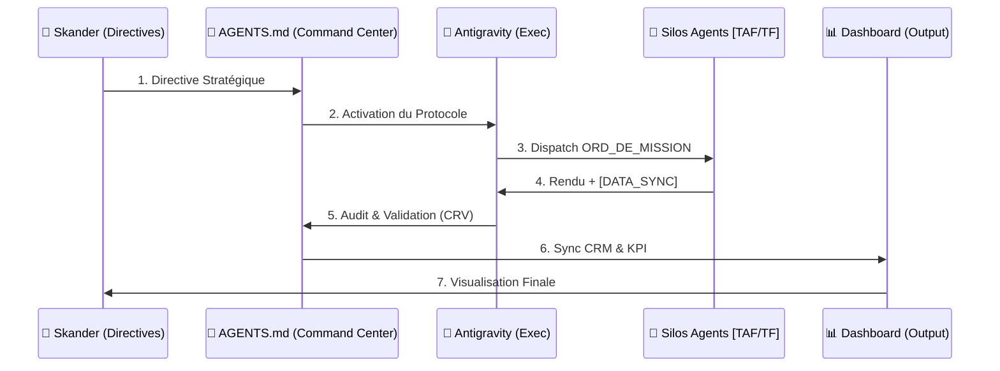

# 🔄 CARTOGRAPHIE DES FLUX OPÉRATIONNELS
> **OBJET** : Cycle de Vie de la Donnée
> **SYSTÈME** : Digital Flux Hub v1.0

## 🛣️ LE VOYAGE D'UNE DIRECTIVE


## 📂 STRUCTURE DES DOSSIERS (ASCII MAP)
```text
/digital flux
├── 00_TOUR_DE_CONTROLE/            <-- Direction Stratégique
│   ├── REGISTRE_PILOTAGE.md        <-- Source de Vérité
│   └── CONFIG_ALGO.json            <-- Algorithme de Prix
├── equipe_agents/                  <-- Centre de Production
│   ├── agent_business/
│   │   ├── TRAVAIL_A_FAIRE/        <-- Boite d'Entrée
│   │   └── TRAVAIL_FAIT/           <-- Boite de Sortie
│   └── agent_dev/
│       ├── TRAVAIL_A_FAIRE/
│       └── TRAVAIL_FAIT/
└── digitalflux_entreprise/
    └── crm/
        └── CRM_PROSPECTS.md        <-- Base de Données Unique
```

## ⚖️ PROTOCOLE DE VALIDATION
| Étape | Critère de Succès | Responsable |
| :--- | :--- | :--- |
| **Input** | Clarté du Brief | CEO |
| **Logic** | Mutation v3.0 Respectée | Agent |
| **Format** | Validité [DATA_SYNC] | COO |
| **Output** | Visibilité Dashboard | Système |
