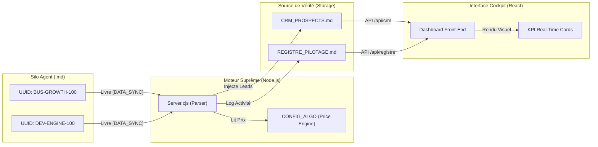

# 🔗 INTERCONNEXIONS TECHNIQUES & SYNCHRONISATION
> **OBJET** : Architecture de Données & Tuyauterie API
> **STATUT** : LIVE / CONNECTED

## 🛠️ RÉSEAU DE SYNCHRONISATION

## 📋 MATRICE DE CONNEXION AGENTS
| ID Agent | UUID | Source Data | Cible Database | Sync Dashboard |
| :--- | :--- | :--- | :--- | :--- |
| **BUSINESS** | `BUS-100` | Google/Med.tn | `CRM_PROSPECTS.md` | ✅ API/CRM |
| **DEV** | `DEV-100` | Codebase | `server.cjs` | ✅ LIVE_LOGS |
| **MEDICAL** | `MED-100` | NotebookLM | `REGISTRE.md` | ✅ COMPLIANCE |

## 🛡️ SÉCURITÉ DES ÉCHANGES
1. **Intégrité v3.0** : Toute chaîne de caractères mal formées est rejetée par le `safeRead()`.
2. **Auto-Correction** : Si `product_price` est manquant, le système utilise la valeur par défaut du `CONFIG_ALGO`.
3. **SSE (Social Side Effects)** : Notifications "Live" vers le Dashboard via le flux `notifyUpdate()`.
