# 📅 CALENDRIER, CADENCE & RITUEL TEMPOREL
> **OBJET** : Orchestration du Temps Opérationnel
> **STRATÉGIE** : Priorité "Impact Financier"

## ⏳ MATRICE DE PRIORITÉ (CADENCE)

```mermaid
gantt
    title Cycle de Travail Typique (24h)
    dateFormat  HH:mm
    axisFormat %H:%M

    section MAINTENANCE (Daily)
    Audit Registre          :08:00, 30m
    Scan Erreurs Cyber      :08:30, 1h
    Mise à jour KPI         :18:00, 30m

    section PRODUCTION (Tasks)
    Mission Business Sourcing :09:00, 4h
    Dev & Debug Dashboard     :14:00, 3h
    Audit Médical Compliance  :10:00, 2h

    section STRATÉGIE (CEO)
    Briefing Matinal        :07:30, 30m
    Revue de Fin de Journée :19:00, 1h
```

## 📊 SYSTÈME DE PRIORITÉ EN CAS DE CONFLIT
| Niveau | Type de Tâche | Impact | Action COO |
| :--- | :--- | :--- | :--- |
| **P1** | 🚨 CRITICAL BUG (Cyber/Dev) | Agence à l'arrêt | Interruption de toute prod |
| **P2** | 💰 SOURCING ELITE (Business) | Revenu immédiat | Prioritaire sur R&D |
| **P3** | 💡 INNOVATION (R&D) | Croissance future | Exécution en tâche de fond |
| **P4** | 👨‍⚕️ COMPLIANCE (Médical) | Sécurité juridique | Audit hebdomadaire ou à la demande |

## 🕹️ MODES D'EXÉCUTION
- **MODE TURBO** : Parallélisation maximale des agents (Consomme plus de ressources).
- **MODE PRÉCISION** : Exécution séquentielle avec audit manuel d'Antigravity entre chaque étape.
- **MODE VEILLE** : Monitoring passif, agents en repos (IDLE).
