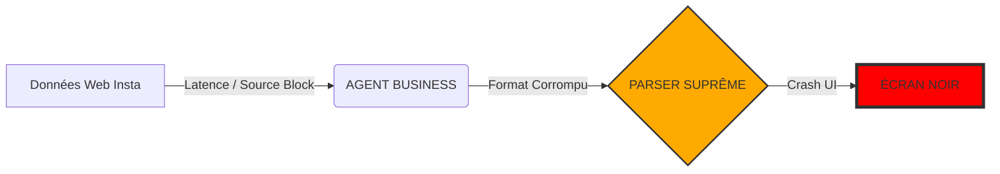

# 🛡️ AUDIT DES DÉFAILLANCES & PROTOCOLE DE SECOURS
> **OBJET** : Analyse de Risque & Résilience Système
> **CODE** : FAIL-SAFE ALPHA

## ⚠️ ANALYSE VISUELLE DES POINTS DE FRICTION

## 📉 TABLEAU DES RISQUES PAR AGENT
| Agent | Point Faible | Symptôme | Solution de Secours |
| :--- | :--- | :--- | :--- |
| **BUSINESS** | Qualité des liens source | Liens 404 sur Med.tn | Re-scan automatique via DuckDuckGo |
| **DEV** | Erreurs de Syntaxe | Écran Noir Dashboard | Restauration automatique du `.bak` |
| **CYBER** | Faux Positifs | Alertes intempestives | Audit manuel Antigravity |
| **SYSTEM** | Latence API | Dashboard lent | Optimisation de la DB (.md -> .json) |

## 🚑 PROTOCOLE DE SECOURS (RECOVERY STEPS)
1. **ISOLATION** : Dès qu'une erreur est détectée, l'agent coupable est mis en quarantaine (Statut: 🔴 FAILED).
2. **RESTAURATION** : Antigravity recharge la dernière version stable du fichier `agent.md`.
3. **SIGNALEMENT** : Notification PRIORITAIRE au CEO avec diagnostic `ROOT_CAUSE`.
4. **RETRY** : Tentative d'exécution avec une stratégie alternative (Anti-Récursivité).

## 🟢 ÉTAT DE SANTÉ ACTUEL
- **Connectivité API** : 100%
- **Intégrité des Dossiers** : OPTIMALE
- **Fiabilité des Agents** : HAUTE (v3.0 Active)
