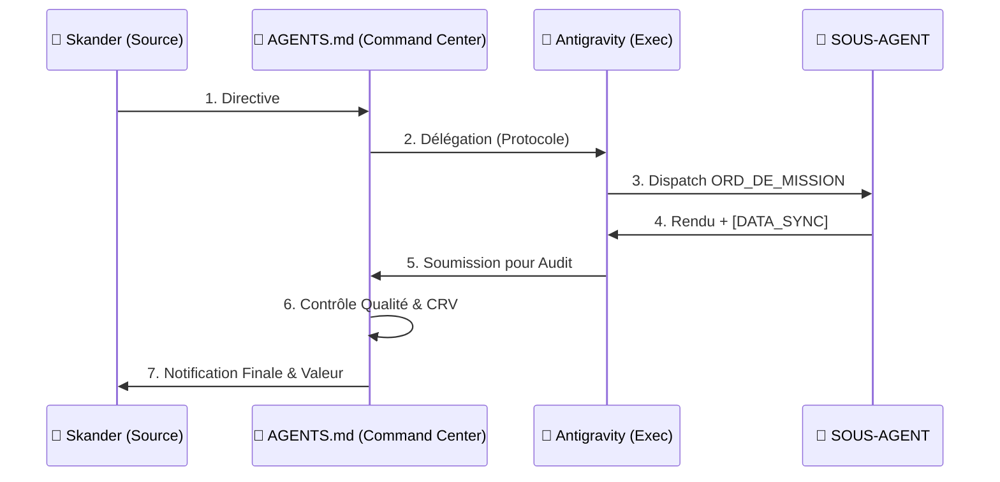

# 🛣️ ROUTING LOGIQUE & MATRICE DES PERMISSIONS
> **OBJET** : Traçabilité de la Donnée & Sécurité des Accès
> **VERSION** : 1.0 (Audit-Ready)

## 1. CARTOGRAPHIE DU ROUTING (LE "PIPE" A-Z)
Le chemin critique d'une information au sein de Digital Flux suit un rail immuable :

1.  **POINT A (Input CEO)** : Votre directive est inscrite directement dans le cerveau central **`AGENTS.md`**.
2.  **MASTER CONTROL (AGENTS.md)** : Analyse de la commande et activation du protocole de dispatching COO.
3.  **DISPATCH (COO)** : Antigravity analyse, génère l'UUID mission et écrit dans le `REGISTRE_PILOTAGE.md`.
4.  **DISTRIBUTION** : Envoi automatisé dans le dossier `/equipe_agents/[AGENT_X]/TRAVAIL_A_FAIRE/`.
5.  **EXÉCUTION (Agent)** : Traitement local, écriture des logs intermédiaires dans `RESULTAT_EN_COURS.md`.
6.  **RETOUR** : Dépôt du livrable final (v3.0) dans `/equipe_agents/[AGENT_X]/TRAVAIL_FAIT/`.
7.  **SOU MISSION (COO)** : Antigravity soumet le livrable fusionné au cerveau central pour audit.
8.  **VALIDATION & CRV (AGENTS.md)** : Contrôle qualité final par le Master Controller et génération du Compte-Rendu de Validation (CRV).
9.  **POINT Z (Output CEO)** : Notification Live sur le Dashboard et archivage.

## 2. MATRICE DES PERMISSIONS & ACCÈS
| Entité | Accès Planning | Accès Dossier Agents | Base de Données | Permission Valider |
| :--- | :--- | :--- | :--- | :--- |
| **CEO (Skander)** | 🟢 Lecture / Écriture | 🟢 Lecture Totale | **Super-Admin** | 👑 OUI (Final) |
| **MASTER CONTROL (AGENTS.md)** | 💎 Constitution | 💎 État de l'Art | **Cerveau Central** | 🧠 OUI (Suprême) |
| **COO (Antigravity)** | ⚡ Gestion Totale | 🟢 Lecture / Écriture | **Admin Opérationnel** | ✅ OUI (Silo) |
| **SOUS-AGENT** | ⚠️ Lecture Seule (Sien) | 📁 Lecture / Écriture (Sien) | **Écriture Log (Sien)** | ❌ NON |

## 3. VISUALISATION DU FLUX DE CONNEXION (NETWORK MAP)

## 4. AUDIT DU STOCKAGE (DATA RESIDENCY)
- **Fichiers Bruts (Missions)** : Stockage **Local** (Souveraineté totale, pas de Cloud tiers pour les ordres de mission).
- **Base de Données Leads** : Stockage **Local (.md)** avec interconnexion **Cloud (Supabase)** en option pour le Dashboard distant.
- **Compte-Rendu Final** : **Duplication Systématique** vers le dossier `[LIVRABLES_INTERNES]` pour éviter toute perte en cas de "Reset" de silo agent.
- **Sûreté MediFlux** : Les données patients traitées par l'Agent Médical sont limitées au silo `/agent_medical/` avec auto-destruction des logs temporaires après validation.

---
*Ce routage garantit que DIGITAL FLUX est conforme aux normes de protection des données (INPDP Tunisie).*
