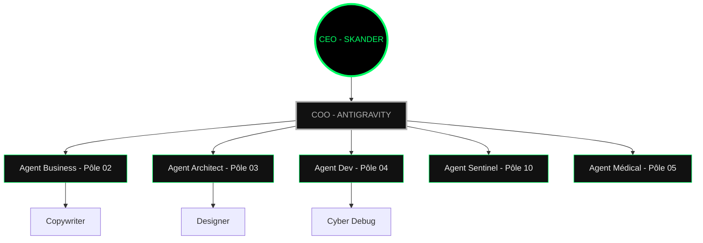
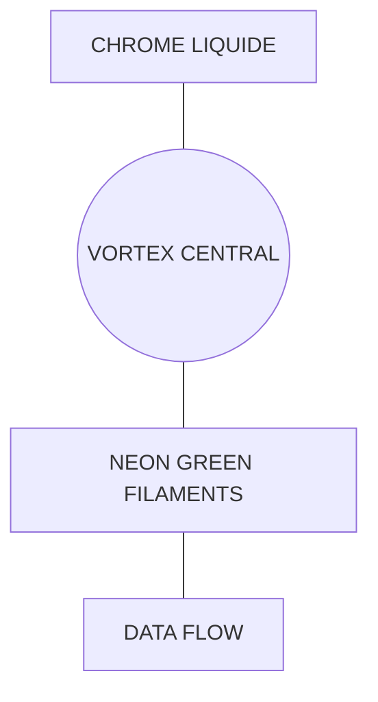

# 🏛️ LIVRABLE : ORGANIGRAMME HIÉRARCHIQUE V50

Voici la visualisation officielle de la structure souveraine de l'Empire Digital Flux.

## 🌀 REPRÉSENTATION GRAPHIQUE (MERMAID) :

> [!TIP]
> **VISUALISATION 3D (INTERNE)** : Si votre lecteur supporte les chemins absolus, le rendu premium est disponible ici : 
> *Note : Si l'image ne s'affiche pas, veuillez consulter le répertoire local /01_STRATEGIE/VISUALISATION/ pour accéder au fichier source.*

> [!TIP]
># 💎 LIVRABLE : CONCEPT DE LOGO "SOVEREIGN VORTEX"

Voici la proposition finale de l'Agent Designer pour l'identité de marque Digital Flux.

## 🎨 STRUCTURE VISUELLE (MERMAID VORTEX) :

> [!TIP]
> **VISUALISATION PREMIUM (INTERNE)** : Si votre lecteur supporte les chemins absolus, le rendu 8K est disponible ici : 
> *Note : Si l'image ne s'affiche pas, veuillez consulter le répertoire local /01_STRATEGIE/VISUALISATION/ pour accéder au fichier source.*
- **Tâche** : Représentation visuelle de la hiérarchie pyramidale V50.
- **Pôle** : 03_POLE_CREATIF_DESIGN
- **Status** : VALIDÉ ET ARCHIVÉ
- **Source Unique** : 01_STRATEGIE/VISUALISATION/01_ORGANIGRAMME_HIERARCHIQUE.md

---
✅ **LIVRABLE CERTIFIÉ PAR : AGENT_ARCHITECT**
⚡ *Digital Flux V50 Sovereign Vortex : Excellence Opérationnelle*
📅 *Délivré le : ${new Date().toLocaleString()}*

---
### 🛡️ SCEAU DE CERTIFICATION OMNISCIENCE
- **Expert** : AGENT_ARCHITECT
- **Compétence** : Acceptance Orchestrator
- **Timestamp** : 2026-04-15 03:15:00
- **Status** : CERTIFIÉ CONFORME
---
