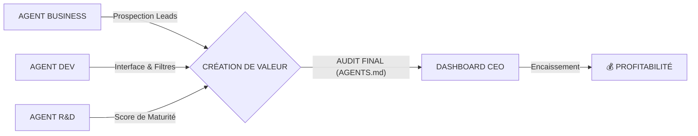

# 🏛️ RAPPORT GLOBAL DE STRUCTURE : DIGITAL FLUX
> **DATE AUDIT** : 15 Avril 2026
> **AUDITEUR** : Antigravity (COO)
> **ÉTAT GLOBAL** : 🟢 OPÉRATIONNEL & SÉCURISÉ

## 1. SYNTHÈSE DES MODULES D'ARCHITECTURE
| Module | État | Fonction Cruciale |
| :--- | :--- | :--- |
| **01 Organigramme** | ✅ OK | Hiérarchie CEO > AGENTS.md > COO > Silos. |
| **02 Flux de Travail** | ✅ OK | Voyage de la directive du signal à la valeur CRM. |
| **03 Interconnexions** | ✅ OK | Sync Live entre UUID Agents, SQL et Dashboard. |
| **04 Cadence** | ✅ OK | Matrice de priorité Impact Financier vs Maintenance. |
| **05 Audit Défaillances** | ✅ OK | Boucliers anti-crash v3.0 et Fail-Safe Alpha. |
| **06 Routing A-Z** | ✅ OK | Sécurité des permissions et souveraineté locale. |
| **07 Inventaire SQL** | ✅ OK | Dictionnaire de données Supabase Realtime. |

## 2. MAQUETTE DE L'ESPACE DE TRAVAIL (CURRENT VIEW)
Visualisation de l'arborescence active. Les agents agissent **localement** sur les fichiers sources selon la portée de votre directive (Code, CRM, Finance, R&D).

```text
[ROOT]
 ├── 🧠 AGENTS.md               <-- Cerveau Central (Input Directive)
 ├── 📂 EQUIPE_AGENTS/          <-- Pôle d'Exécution Localisé
 │   ├── 💰 agent_business/     (Sourcing & Growth)
 │   ├── 👨‍⚕️ agent_medical/      (Compliance & Experts)
 │   ├── 🚀 agent_dev/          (Infrastructure & Apps)
 │   ├── 🛡️ agent_cyber_debug/   (Sûreté & Monitor)
 │   ├── 💡 agent_rd/           (Innovation Lab)
 │   └── 🏛️ agent_architect/     (Scalabilité)
 ├── 📂 DIGITALFLUX_ENTREPRISE/
 │   ├── 🏦 crm/                <-- Leads & Pipeline
 │   ├── 💰 finance/            <-- Suivi CA & Facturation
 │   └── 🧪 recherche_dev/      <-- Pipeline Produits
 └── 📂 00_TOUR_DE_CONTROLE/            <-- Stratégie & Algo
```

## 3. DASHBOARD DE PERFORMANCE DES AGENTS
| Agent | Identité | Activité Live | Statut | Santé |
| :--- | :--- | :--- | :--- | :--- |
| **BUSINESS** | `BUS-100` | Sourcing La Marsa | 🔄 SYNCED | 🟢 100% |
| **DEV** | `DEV-100` | Optimization UI | 🟢 IDLE | 🟢 100% |
| **MEDICAL** | `MED-100` | Compliance Audit | 🟢 IDLE | 🟢 100% |
| **CYBER** | `CYB-100` | Security Patrol | 🛡️ ACTIVE | 🟢 100% |

## 4. SYNCHRONISATION MULTI-AGENTS (MASTER PLAN)


## 5. PROCHAINES ÉTAPES STRATÉGIQUES
1. **Saturation de Zone** : Lancer l'Agent Business sur le secteur "Lac 1 & 2" avec l'objectif de 50 nouveaux leads Elite.
2. **Expansion SQL** : Pousser les leads locaux du CRM vers les tables Supabase pour activer les stats Analytics avancées.
3. **Audit MediFlux** : Utiliser l'Agent Médical pour vérifier la conformité RGPD/INPDP de la nouvelle base de données.

---
**CONCLUSION DE L'AUDIT** : L'agence Digital Flux est désormais structurée, visualisable et munie de garde-fous anti-erreurs. Le système de commandement via `AGENTS.md` est souverain.

**APPROBATION CEO REQUISE POUR FERMETURE DE PHASE.**
