# 📜 LE GRAND ATLAS DE L'EMPIRE : Digital Flux (V50.12)

> [!IMPORTANT]
> **SOURCE DE VÉRITÉ SOUVERAINE** : Ce document est synchronisé en temps réel avec la structure physique des agents.

## 🏛️ 1. LA PYRAMIDE DE COMMANDEMENT

```mermaid
graph TD
    CEO["👑 CEO (Skander)"] --> COO["🧠 COO (Antigravity)"]
    COO --> 01_POLE_DIRECTION_STRATEGIQUE["🏢 01_POLE_DIRECTION_STRATEGIQUE"]
    01_POLE_DIRECTION_STRATEGIQUE --> AGENT_SYNTHESE["👤 AGENT_SYNTHESE"]
    COO --> 02_POLE_COMMERCIAL_SALES["🏢 02_POLE_COMMERCIAL_SALES"]
    02_POLE_COMMERCIAL_SALES --> AGENT_BUSINESS["👤 AGENT_BUSINESS"]
    COO --> 03_POLE_CREATIF_DESIGN["🏢 03_POLE_CREATIF_DESIGN"]
    03_POLE_CREATIF_DESIGN --> AGENT_ARCHITECT["👤 AGENT_ARCHITECT"]
    03_POLE_CREATIF_DESIGN --> AGENT_COPYWRITER["👤 AGENT_COPYWRITER"]
    03_POLE_CREATIF_DESIGN --> AGENT_DESIGNER["👤 AGENT_DESIGNER"]
    COO --> 04_POLE_TECH_ET_CYBER["🏢 04_POLE_TECH_ET_CYBER"]
    04_POLE_TECH_ET_CYBER --> AGENT_CYBER_DEBUG["👤 AGENT_CYBER_DEBUG"]
    04_POLE_TECH_ET_CYBER --> AGENT_DEV["👤 AGENT_DEV"]
    COO --> 05_POLE_MEDICAL_ET_SANTE["🏢 05_POLE_MEDICAL_ET_SANTE"]
    05_POLE_MEDICAL_ET_SANTE --> AGENT_MEDICAL["👤 AGENT_MEDICAL"]
    COO --> 06_POLE_FINANCE_ET_ROI["🏢 06_POLE_FINANCE_ET_ROI"]
    06_POLE_FINANCE_ET_ROI --> AGENT_FINANCE["👤 AGENT_FINANCE"]
    COO --> 07_POLE_JURIDIQUE_ET_CONTRATS["🏢 07_POLE_JURIDIQUE_ET_CONTRATS"]
    07_POLE_JURIDIQUE_ET_CONTRATS --> AGENT_JURIDIQUE["👤 AGENT_JURIDIQUE"]
    COO --> 08_POLE_RD_ET_INNOVATION["🏢 08_POLE_RD_ET_INNOVATION"]
    08_POLE_RD_ET_INNOVATION --> AGENT_RD["👤 AGENT_RD"]
```

## 🤝 2. FLUX OPÉRATIONNEL : "QUI PASSE QUOI À QUI"

| Source | Destination | Flux de Production | Type de Livrable |
| :--- | :--- | :--- | :--- |
| CEO (Input) | Antigravity (COO) | Ingestion Stratégique | Brief Alpha |
| Antigravity | Tous Agents | Dispatching V50 / Vortex | Ordre de Mission |
| Agent (Production) | Antigravity | Audit de Qualité Certifié | Livrable Alpha |
| Antigravity | CEO (Livrables) | Livraison Souveraine | Produit Final |

## 👥 3. ANNUAIRE DES AGENTS D'ÉLITE (CENSUS)

| Agent | Pôle | Mission Stratégique | Statut |
| :--- | :--- | :--- | :--- |
| **AGENT_SYNTHESE** | 01_POLE_DIRECTION_STRATEGIQUE | Expert en condensation de données et audit de performance. Votre mission est de produire la vision h... | 🔴 STANDBY |
| **AGENT_BUSINESS** | 02_POLE_COMMERCIAL_SALES | Expert en Sourcing Médical et Stratégie d'Acquisition B2B. Votre mission est d'alimenter la croissan... | 🔴 STANDBY |
| **AGENT_ARCHITECT** | 03_POLE_CREATIF_DESIGN | Garant de la cohérence systémique et esthétique de Digital Flux. Votre mission est d'orchestrer les ... | 🔴 STANDBY |
| **AGENT_COPYWRITER** | 03_POLE_CREATIF_DESIGN | Expert en narration de marque et rédaction persuasive. Votre mission est de transformer les stratégi... | 🔴 STANDBY |
| **AGENT_DESIGNER** | 03_POLE_CREATIF_DESIGN | L'Agent Designer est le maître de l'identité visuelle de Digital Flux. Votre espace de travail est d... | 🔴 STANDBY |
| **AGENT_CYBER_DEBUG** | 04_POLE_TECH_ET_CYBER | Expert en cybersécurité, audit de code et débogage intensif. Votre mission est de sécuriser les flux... | 🔴 STANDBY |
| **AGENT_DEV** | 04_POLE_TECH_ET_CYBER | Développeur Full-Stack et Architecte Logiciel. Votre mission est de construire et de maintenir l'éco... | 🔴 STANDBY |
| **AGENT_MEDICAL** | 05_POLE_MEDICAL_ET_SANTE | Expert en conformité médicale, bio-éthique et santé digitale. Votre mission est de garantir la rigue... | 🔴 STANDBY |
| **AGENT_FINANCE** | 06_POLE_FINANCE_ET_ROI | Expert en ROI, facturation stratégique et gestion de trésorerie. Votre mission est de transformer ch... | 🔴 STANDBY |
| **AGENT_JURIDIQUE** | 07_POLE_JURIDIQUE_ET_CONTRATS | Expert en droit des affaires, propriété intellectuelle et conformité internationale. Votre mission e... | 🔴 STANDBY |
| **AGENT_RD** | 08_POLE_RD_ET_INNOVATION | Explorateur technologique et ingénieur d'innovation. Votre mission est d'étudier les ruptures techno... | 🔴 STANDBY |

## 🌪️ 4. LOGIQUE DE ROUTAGE VORTEX

1. **Ingestion** : Les fichiers arrivent dans `01_STRATEGIE/ENTRÉE_CEO`.
2. **Analyse Intent** : Antigravity identifie le besoin (Web, Design, Business, etc.).
3. **Dispatch** : Les agents reçoivent une `AUTO_MISSION` avec injection de Skills.
4. **Collaboration** : Les tags `#COLLAB` permettent des échanges entre agents.
5. **Certification** : Seul le score >= 8.0/10 permet la sortie du système.

---
*Dernière synchronisation impériale : 4/17/2026, 4:02:53 PM*
*Souveraineté, Précision, Excellence. Digital Flux V50.12*